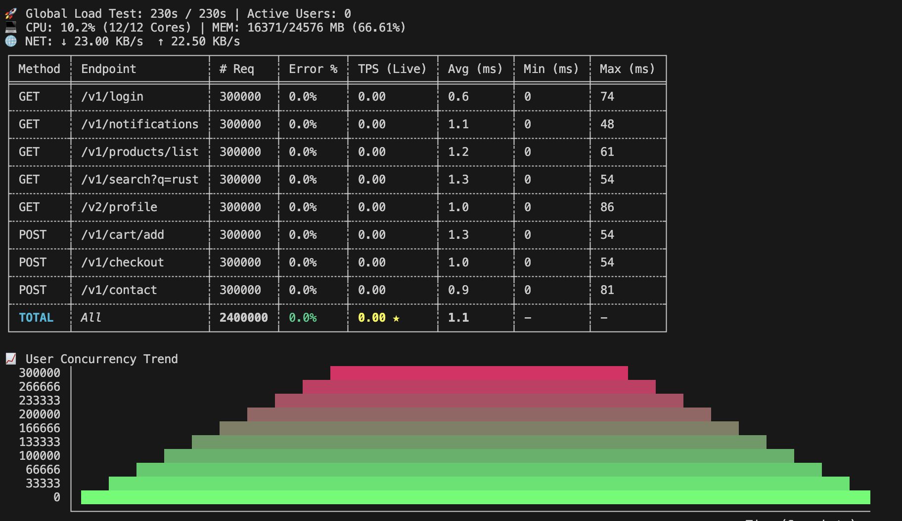
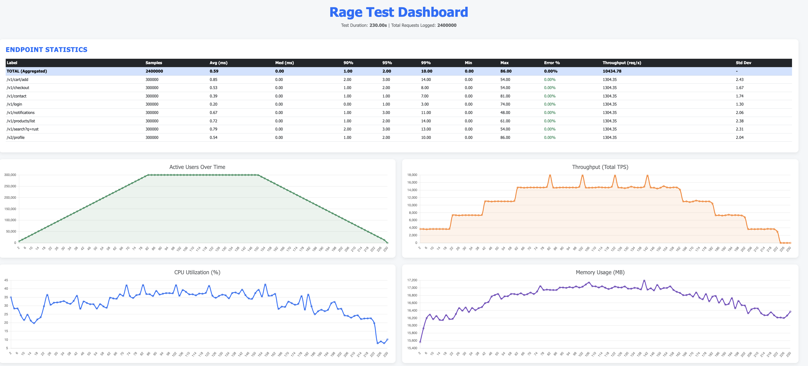

# RAGE

A minimal, high-performance load testing engine focused on stripping scripting overhead and squeezing maximum efficiency out of your load-generator hardware.


## Features & Milestone Updates

### Core Capabilities

* **Scale:** Multi-user & target TPS management.
* **REST Ecosystem:** Full support for standard verbs, query parameters, dynamic headers, and JSON bodies.
* **Data Flow:** CSV seeding per virtual user (VU) and runtime variable injection (token chaining).
* **Reporting:** Real-time CLI output, raw CSV archiving, and HTML dashboards.

### Resolved Performance Optimizations

* **Multi-Core Scaling:** Fully optimized. Spreads execution across all available logical cores instead of bottlenecking on a single core.
* **Network & Resource Telemetry:** Fixed ingress/egress reporting accuracy. System memory usage tracking updated to precise percentages.
* **VUs Metric:** Implemented a real-time active users graph in the HTML/JSON reporting view.
* **Internal Layers:** Validated API pacing loops for tight TPS enforcement and clean dashboard updates.

---

## Rust Environment Setup

### 1. Install Rust Toolchain

* **Linux / macOS:**
```bash
curl --proto '=https' --tlsv1.2 -sSf https://sh.rustup.rs | sh

```


*(Restart your terminal or run `source $HOME/.cargo/env` after completion).*
* **Windows:** Download and run `rustup-init.exe` from [rustup.rs](https://rustup.rs/). *Requires Visual Studio Build Tools with C++ workload.*

### 2. Verify

```bash
cargo --version

```

### 3. Run a Test

Always run with the `--release` flag to strip debugging overhead and enable compiler optimizations necessary to sustain massive load simulations:

```bash
cargo run --release

```

---

## YAML Configuration Specification

Your `test.yaml` maps out execution params and scenarios using simple key-value pairings, indented structures, and arrays (`-`).

### Metadata & Control Parameters

* **`host`**: Root URL targeting the system under test.
* **`testname`**: Identifier tag for output metrics and reports.
* **`max_cores`**: Resource allocation limit. `-1` commands RAGE to spin up workers across all available CPU threads.
* **`users`**: Target concurrency envelope ($300,000$ virtual users).
* **`rampup`**: Duration (in seconds) to linearly scale up active threads to full capacity.
* **`session_duration` / `runtime`**: Boundary configurations controlling thread lifetimes and global test duration bounds (in seconds).
* **`sleep`**: Default pacing interval (in milliseconds) executed between operational steps to prevent instant runner exhaustion.
* **`csv_config`**: External text array containing user parameters (e.g., email data fields) used for runtime query mapping.

### Step Syntax & Execution Mapping

RAGE interprets steps as sequential executions down an array layer.

* **Method blocks (`get:`, `post:`)**: Dictate request type.
* **`capture:`**: Binds runtime response paths (like `json.token`) into internal string identifiers (`$token`).
* **Variable References**: Prefixed with `$` (e.g., `$token` dynamically pulls from memory, `$csv.email` reads sequentially from `users.csv`).
* **`common_headers`**: Base key-value pairs appended globally across every endpoint signature inside the scenario list.

## Runtime Reporting Format
This is how the reports look like while the test is still running



## Final HTML Report
This is how the simple version of the report looks like after the completion of the test.

